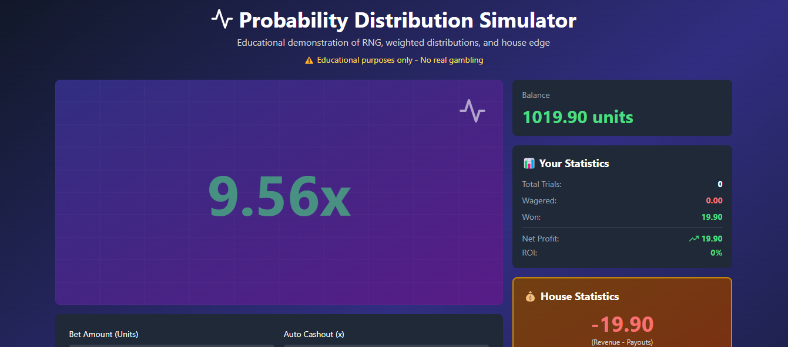

# 🎲 Probability Distribution Simulator

An interactive educational simulation demonstrating probability theory, weighted distributions, and expected value calculations in real-time.

## 🚀 Live Demo

**👉 [Try the Interactive Demo Here!](https://bahasalah255.github.io/probability-simulator/)**

Experience the simulator in action - no installation required. See how probability distributions and house edge work in real-time.

---

## 🎯 Purpose

This project was built for **educational purposes** to help developers and students understand:

- How **Random Number Generation (RNG)** works
- **Weighted probability distributions**
- **Expected value** and mathematical outcomes
- Why **house edge** guarantees long-term profitability in probability-based systems
- The mathematics behind why "beating the system" is impossible

## ⚠️ DISCLAIMER

**This is purely an educational tool for learning mathematics and probability theory.**

- ❌ NOT intended for real gambling
- ❌ NOT promoting betting or wagering
- ❌ NO real money involved
- ⚠️ Gambling is illegal in Morocco and causes harm

The author does not endorse or promote gambling activities in any form.

---

*(rest of README continues...)*
